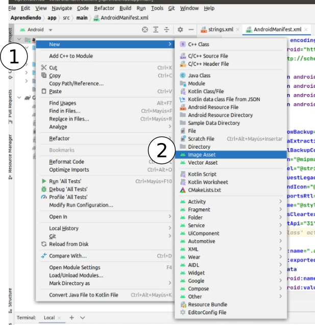
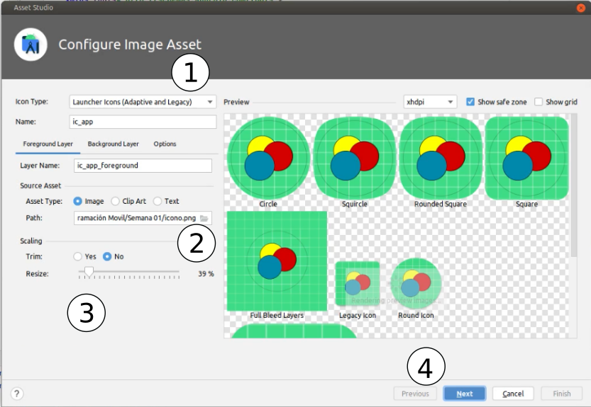

# Cambiar Nombre e Ícono de App

- [Introducción](#introducción)
- [Cambiar Nombre](#cambiar-nombre)
- [Cambiar Ícono](#cambiar-icono)

---

## Introducción

Se desplegará una aplicación en Express JS en Replit

## Cambiar Nombre

Para cambiar el nombre de nuestra App, debemos ir al archivo <b>strings.xml</b> que se encuentre en <b>res/values</b> y cambiar el valor de la etiqueta <b>app_name</b>.

```xml
...
<string name="app_name">Aprendiendo</string>
...
```

## Cambiar Ícono

Para cambiar el ícono de la aplicación vamos a crear un nuevo ícono usando Android Studio, haciendo click derecho <b>New/Image Asset</b>



Luego debemos de seleccionar un nombre a nuestro nuevo ícono, como también seleccionar el archivo fuente, fondo y zoom.



Finalmente debemos ir al archivo <b>AndroidManifest.xml</b> y 
reemplazar los nombres de los iconos por el nuevo que hemos subido en el paso anterior.

```xml
<application
  ...
  android:icon="@mipmap/nombre_nuevo"
  android:roundIcon="@mipmap/nombre_nuevo"
  ...
```

---

Fuentes:

- https://www.youtube.com/watch?v=aUPgYLfl6f0