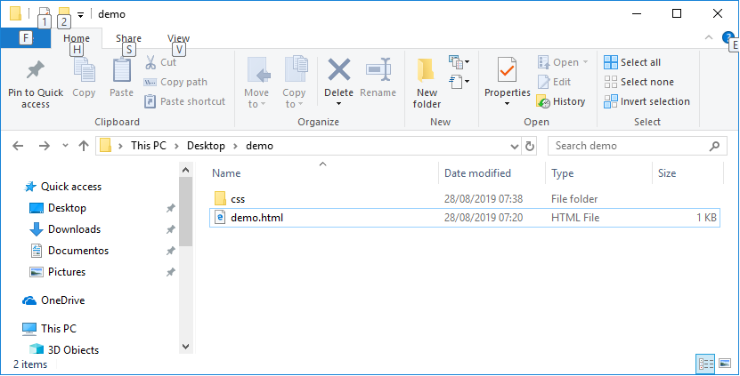
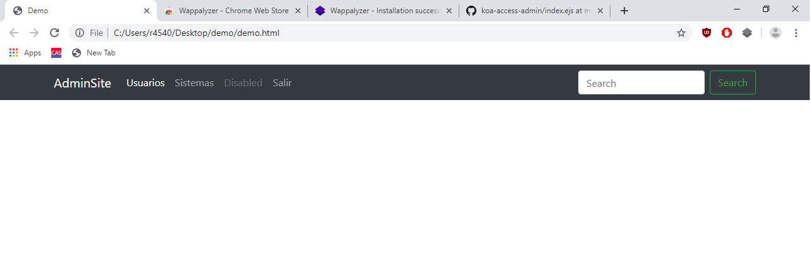
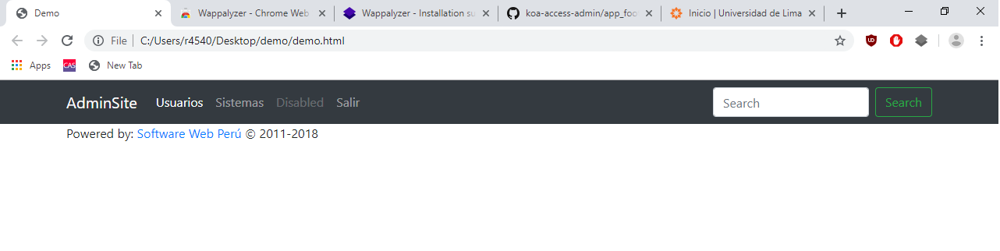
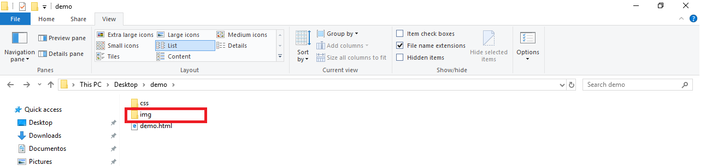
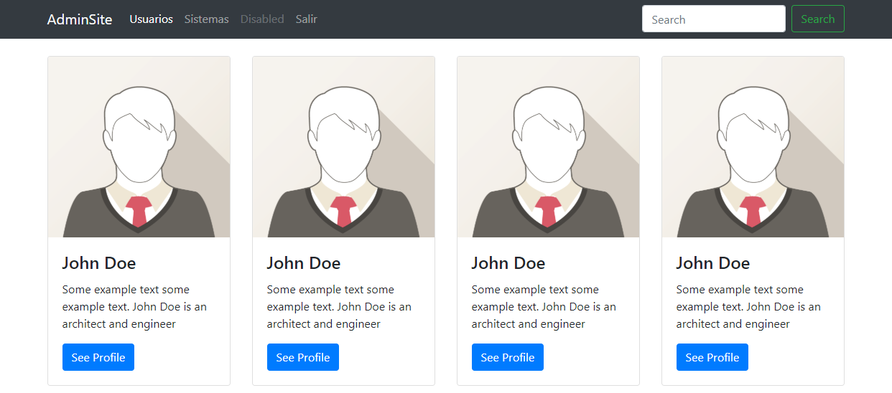
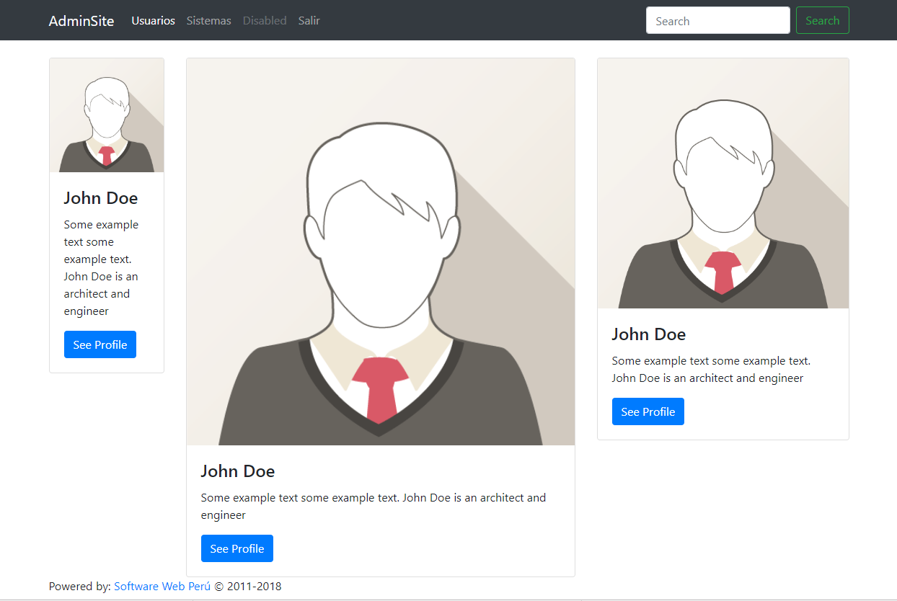

# Navegación con Bootstrap 4

- [Navegación con Bootstrap 4](#navegaci%c3%b3n-con-bootstrap-4)
  - [Introducción](#introducci%c3%b3n)
  - [Crear Proyecto](#crear-proyecto)
  - [Importar Librería](#importar-librer%c3%ada)
  - [Menú de Navegación](#men%c3%ba-de-navegaci%c3%b3n)
  - [Footer](#footer)
  - [Sistema de Grillas](#sistema-de-grillas)

## Introducción

Lo que se va a realizar es un menu de navegación con Bootstrap.

## Crear Proyecto

Para crear el proyecto vamos a crear una carpeta llamada 'demo' (ver Imagen 1). 



*Imagen 1: Folder del proyecto*

Una vez creada la carpeta vamos a crear un archivo llamado 'demo.html' y una carpeta llamada 'css'. El presente archivo tendrá el siguiente código:

```html
<!DOCTYPE html>
<html>
<head>
    <meta charset="UTF-8">
    <meta name="viewport" content="width=device-width, initial-scale=1, shrink-to-fit=no">
	<title>Demo</title>
</head>
<body>

</body>
</html>
```

## Importar Librería

Hay distintar maneras de importar Bootstrap a un proyecto web, en este caso vamos a ver dos maneras, 1) desde CDN y 2) descargar zip.

1. Desde CDN

Dentro de '&lt;head&gt;' pegamos el siguiente código [1]:

```html
<link rel="stylesheet" href="https://stackpath.bootstrapcdn.com/bootstrap/4.3.1/css/bootstrap.min.css" integrity="sha384-ggOyR0iXCbMQv3Xipma34MD+dH/1fQ784/j6cY/iJTQUOhcWr7x9JvoRxT2MZw1T" crossorigin="anonymous">
```

2. Descargar ZIP

Hacemo click en el siguiente hipervínculo para decargar el zip que contiene las librerías a usar: [link](https://github.com/twbs/bootstrap/releases/download/v4.3.1/bootstrap-4.3.1-dist.zip). Una vez descargado el zip, deberá descomprimir el contenido buscar el archivo 'bootstrap.min.css' que se encuentra en la carpeta 'css' del zip. Una vez encontrado el archivo este deberá se copia y pegado en la carpeta 'css' de nuestro proyecto creado en el paso anterior, [ir](#crear-proyecto), ver Imagen 2.


*Imagen 2: Importando css de bootstrap en nuestro proyecto*

Ahora, si deseamos usar el archivo css de bootstrap en nuestro proyecto web, dentro de '&lt;head&gt;' pegamos el siguiente código:

```html
<link rel="stylesheet" href="css/bootstrap.min.css">
```

## Menú de Navegación

Para crear un menú de navegación con bootstrap es con el siguiente código:

```html
<nav class="navbar navbar-expand-lg navbar-dark bg-dark">
    <div class="container">
        <a class="navbar-brand" href="#">AdminSite</a>
        <button class="navbar-toggler" type="button" data-toggle="collapse" data-target="#navbarSupportedContent" aria-controls="navbarSupportedContent" aria-expanded="false" aria-label="Toggle navigation">
        <span class="navbar-toggler-icon"></span>
        </button>
        <div class="collapse navbar-collapse" id="navbarSupportedContent">
            <ul class="navbar-nav mr-auto">
                <li class="nav-item active">
                    <a class="nav-link" href="#">Usuarios <span class="sr-only">(current)</span></a>
                </li>
                <li class="nav-item">
                    <a class="nav-link" href="#/systems">Sistemas <span class="sr-only">(current)</span></a>
                </li>
                <li class="nav-item">
                    <a class="nav-link disabled" href="#">Disabled</a>
                </li>
                <li class="nav-item">
                    <a class="nav-link" href="/login/close">Salir</a>
                </li>
            </ul>
            <form class="form-inline my-2 my-lg-0">
                <input class="form-control mr-sm-2" type="search" placeholder="Search" aria-label="Search">
                <button class="btn btn-outline-success my-2 my-sm-0" type="submit">Search</button>
            </form>
        </div>
    </div>
</nav>
```

Nótece las clases que se están usando en el código, por ejemplo la clase 'contanier' que hace que el contenido del 'div' se encuentre centrado en la pantalla dejando un margen a la izquierda y derecha (ver Imagen 3).



*Imagen 3: Menú de navegación*

## Footer

Para crear un footer para nuestra aplicación con bootstrap es con el siguiente código debajo el código del menú de navegación:

```html
<footer>
    <div class="container">
        <p>Powered by: <a href="http://softweb.pe/">Software Web Perú</a> © 2011-2018 </p>
    </div>
</footer>
```

Deberíamos tener la vista mostrada en la Imagen 4.



*Imagen 4: Footer del sitio*

## Sistema de Grillas

Boostrap usa un sistema de grillas para dividir verticalmente una fila (ver Imagen 5) que están identificadas con la clase 'row'. Vamos ahora dos maneras para usar el sistema de grillas, división automática y asignación manual.


*Imagen 5: Sistema de grillas*

Para el contenido a usar en los ejemplos del sistema de grillas vamos a usar el siguiente contenido html:

```html
<div class="col-sm">
    <div class="card" >
        
        <div class="card-body">
            <h4 class="card-title">John Doe</h4>
            <p class="card-text">Some example text some example text. John Doe is an architect and engineer</p>
            <a href="#" class="btn btn-primary">See Profile</a>
        </div>
    </div>
</div>
```

En el código mostrado se usa una imagen, la cuál se descargará del [link](https://www.w3schools.com/bootstrap4/img_avatar1.png). Una vez descargada la imagen, crearemos en la raiz de nuestro proyecto una carpeta llamada 'img', dentro de la que se colocará la imagen descargada (ver Imagen 6). Nótece que el nombre de la imagen descargada deberá ser nombrada en el directorio como 'img_avatar1.png'.



*Imagen 6: Carpeta de imágenes*

1. División Automáctica

En la asignación automática será usando la clase 'col-sm' dentro los 'div.row'. El uso de esta clase hará que se divida el ancho de la fila de manera proporcional a la cantidad de 'col-sm' presentes, aceptando un máximo de 12 subdivisiones por fila. El código mostrado a continuación generará la imagen mostrada en la Imagen 7. 

```html
<div class="container">
	<div class="row">
		<div class="col-sm">
		  	<!-- contenido a usar en los ejemplos del sistema de grillas -->
		</div>
		<div class="col-sm">
		  	<!-- contenido a usar en los ejemplos del sistema de grillas -->
        </div>
        <div class="col-sm">
		  	<!-- contenido a usar en los ejemplos del sistema de grillas -->
        </div>
        <div class="col-sm">
		  	<!-- contenido a usar en los ejemplos del sistema de grillas -->
		</div>
	</div>
</div>
```



*Imagen 7: División automática de columnas*

2. Asignación Manual

En la asignación maual será usando la clase 'col-md-1', 'col-md-2', 'col-md-3', 'col-md-4', 'col-md-5', 'col-md-6', 'col-md-7', 'col-md-8', 'col-md-9', 'col-md-10' y 'col-md-12' dentro los 'div.row'. El uso de esta clase hará que se divida el ancho de la fila de manera proporcional al número usado al final de cada una de las clases 'col-md'. Hay que tener en cuenta que la suma de dichos número no supere el doce. El código mostrado a continuación generará la imagen mostrada en la Imagen 8.

```html
<div class="container">
	<div class="row">
		<div class="col-md-2">
		  	<!-- contenido a usar en los ejemplos del sistema de grillas -->
		</div>
		<div class="col-md-6">
		  	<!-- contenido a usar en los ejemplos del sistema de grillas -->
        </div>
        <div class="col-md-4">
		  	<!-- contenido a usar en los ejemplos del sistema de grillas -->
		</div>
	</div>
</div>
```



*Imagen 8: División manual de columnas*

---

Fuentes

[1] https://getbootstrap.com/docs/4.3/getting-started/introduction/ <br>
[2] https://getbootstrap.com/docs/4.3/getting-started/download/ <br>
[3] https://github.com/pepeul1191/koa-access-admin