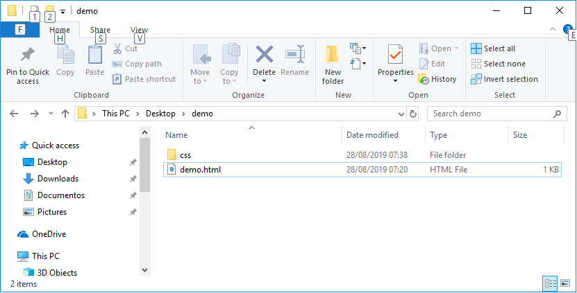
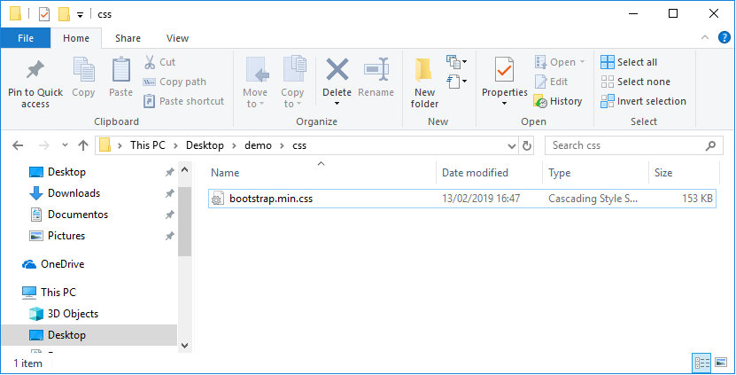
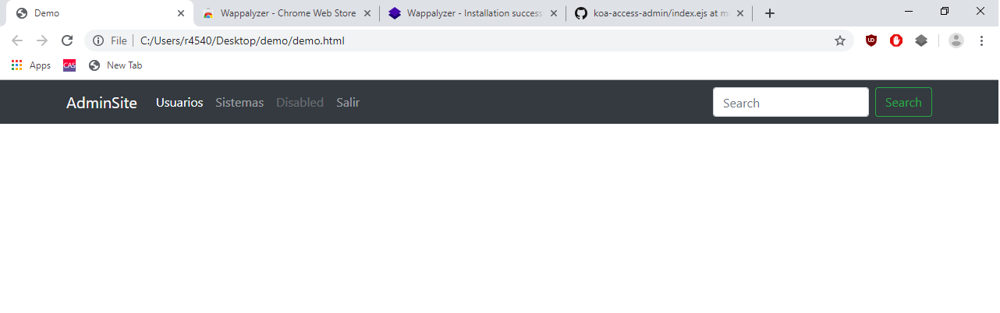
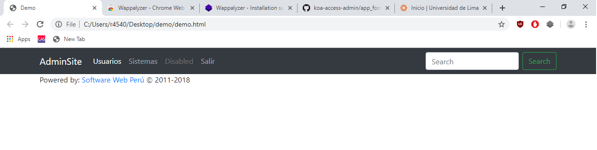

# Navegación con Bootstrap 4

- [Navegación con Bootstrap 4](#navegaci%c3%b3n-con-bootstrap-4)
  - [Introducción](#introducci%c3%b3n)
  - [Crear Proyecto](#crear-proyecto)
  - [Importar Librería](#importar-librer%c3%ada)
  - [Menú de Navegación](#men%c3%ba-de-navegaci%c3%b3n)
  - [Footer](#footer)

## Introducción

Lo que se va a realizar es un menu de navegación con Bootstrap.

## Crear Proyecto

Para crear el proyecto vamos a crear una carpeta llamada 'demo' (ver Imagen 1). 



*Imagen 1: Folder del proyecto*

Una vez creada la carpeta vamos a crear un archivo llamado 'demo.html' y una carpeta llamada 'css'. El presente archivo tendrá el siguiente código:

```html
<!DOCTYPE html>
<html>
<head>
    <meta charset="UTF-8">
    <meta name="viewport" content="width=device-width, initial-scale=1, shrink-to-fit=no">
	<title>Demo</title>
</head>
<body>

</body>
</html>
```

## Importar Librería

Hay distintar maneras de importar Bootstrap a un proyecto web, en este caso vamos a ver dos maneras, 1) desde CDN y 2) descargar zip.

1. Desde CDN

Dentro de '&lt;head&gt;' pegamos el siguiente código [1]:

```html
<link rel="stylesheet" href="https://stackpath.bootstrapcdn.com/bootstrap/4.3.1/css/bootstrap.min.css" integrity="sha384-ggOyR0iXCbMQv3Xipma34MD+dH/1fQ784/j6cY/iJTQUOhcWr7x9JvoRxT2MZw1T" crossorigin="anonymous">
```

2. Descargar ZIP

Hacemo click en el siguiente hipervínculo para decargar el zip que contiene las librerías a usar: [link](https://github.com/twbs/bootstrap/releases/download/v4.3.1/bootstrap-4.3.1-dist.zip). Una vez descargado el zip, deberá descomprimir el contenido buscar el archivo 'bootstrap.min.css' que se encuentra en la carpeta 'css' del zip. Una vez encontrado el archivo este deberá se copia y pegado en la carpeta 'css' de nuestro proyecto creado en el paso anterior, [ir](#crear-proyecto), ver Imagen 2.



*Imagen 2: Importando css de bootstrap en nuestro proyecto*

Ahora, si deseamos usar el archivo css de bootstrap en nuestro proyecto web, dentro de '&lt;head&gt;' pegamos el siguiente código:

```html
<link rel="stylesheet" href="css/bootstrap.min.css">
```

## Menú de Navegación

Para crear un menú de navegación con bootstrap es con el siguiente código:

```html
<nav class="navbar navbar-expand-lg navbar-dark bg-dark">
    <div class="container">
        <a class="navbar-brand" href="#">AdminSite</a>
        <button class="navbar-toggler" type="button" data-toggle="collapse" data-target="#navbarSupportedContent" aria-controls="navbarSupportedContent" aria-expanded="false" aria-label="Toggle navigation">
        <span class="navbar-toggler-icon"></span>
        </button>
        <div class="collapse navbar-collapse" id="navbarSupportedContent">
            <ul class="navbar-nav mr-auto">
                <li class="nav-item active">
                    <a class="nav-link" href="#">Usuarios <span class="sr-only">(current)</span></a>
                </li>
                <li class="nav-item">
                    <a class="nav-link" href="#/systems">Sistemas <span class="sr-only">(current)</span></a>
                </li>
                <li class="nav-item">
                    <a class="nav-link disabled" href="#">Disabled</a>
                </li>
                <li class="nav-item">
                    <a class="nav-link" href="/login/close">Salir</a>
                </li>
            </ul>
            <form class="form-inline my-2 my-lg-0">
                <input class="form-control mr-sm-2" type="search" placeholder="Search" aria-label="Search">
                <button class="btn btn-outline-success my-2 my-sm-0" type="submit">Search</button>
            </form>
        </div>
    </div>
</nav>
```

Nótece las clases que se están usando en el código, por ejemplo la clase 'contanier' que hace que el contenido del 'div' se encuentre centrado en la pantalla dejando un margen a la izquierda y derecha (ver Imagen 3).




## Footer

Para crear un footer para nuestra aplicación con bootstrap es con el siguiente código debajo el código del menú de navegación:

```html
<footer>
    <div class="container">
        <p>Powered by: <a href="http://softweb.pe/">Software Web Perú</a> © 2011-2018 </p>
    </div>
</footer>
```

Deberíamos tener la vista mostrada en la Imagen 4.



---

Fuentes

[1] https://getbootstrap.com/docs/4.3/getting-started/introduction/ <br>
[2] https://getbootstrap.com/docs/4.3/getting-started/download/
[3] https://github.com/pepeul1191/koa-access-admin