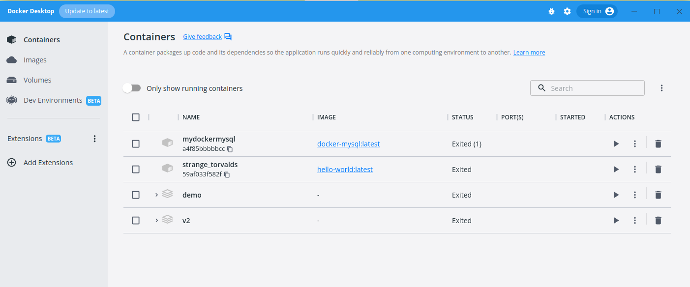

# Oracle Express - Docker

## Introducción

En el siguiente tutorial crearemos una imagen de un contendor en Docker que tenga instalado Oracle Express. Posteriormente crearemos un nuevo usuario en la base de datos y le asignaremos roles para que pueda interactuar con la base de datos para ejecutar comandos DDL, DML, procedimientos almacenados, funciones y triggers.

Los links para descargar los instaladores se encuentran la final del presente documento.

## Abrir Docker Desktop

Buscar en el menú de inicio la aplicación Oracle Desktop.



Además deberá de comprobar que Docker esté agregado en el PATH del sistema opertivo usando el siguiente código en el <b>cmd</b>:

    > docker -v

Esto deberá arrojar el siguiente mensaje:

    > Docker version 20.10.17, build 100c701


## Crear contenedor desde imagen

Crear en un directorio un archivo llamado <b>docker-compose.yml</b> y colocar el siguiente código

``` yml
version: '3'

services: 
  oracle-db:
    image: oracleinanutshell/oracle-xe-11g:latest
    ports:
      - 1521:1521
      - 5500:5500
      - 8080:8080
    environment: 
      - ORACLE_ALLOW_REMOTE=true
      - ORACLE_ENABLE_XDB=true
```

Una vez que haya creado y guardado el archivo <b>docker-compose.yml</b>, abrir un <b>cmd</b> en la misma raíz dónde está el archivo y ejecutar el siguiente para crear el contenedor en función al contenido del archivo.

    > docker compose up


En caso que haya un error que indique que el puerto <b>123</b> esté ocupado, es porque ya hay un servicio en el sistema operativo ejecutándose en ese puerto. Para solucionar el error deberá cambiar la configruación de los puertos en el archivo <b>docker-compose.yml</b>. El cambio del puerto debería debería ser el primer <b>1521</b> por otro valor de un puerto que no se encuentre en uso.

Una vez que termine de descargarse la imagen, esta comenzará a ejecutarse. Lo que haremos a continuación, será cerrar el contenedor ejecutado en la línea de comandos para luego volverlo a levantar mediante el Docker Desktop.


## Acceder al contendor y crear accesos y roles

Primero hay que asegurarnos que el contenedor esté activo, y usaremos el siguente comando para conocer el <b>id</b> del contenedor. Este <b>id</b> será útil más adelante.

    > docker ps


Con ese <b>id</b> nos conecteremos por el <b>cmd</b> al contendor. Para dicho fin usaremoe el siguiente código en el <b>cmd</b>:

    > docker exec -it <id_container> bash


Una vez dentro del contenedor entraremos al servicio de Oracle Express para crear un usuario y darle los roles que este usuario necesita para acceder y hacer operaciones DDL, DML, procedimientos almacenados, funciones y triggers en la base de datos. El comando es el siguiente:

    $ sqlplus

Este comando hará solicitar un usuario y contraseña para poder continuar. El usuario es <b>system</b> y la contraseña es <b>oracle</b>. Una vez dentro, procederemos a crear un usuario, se llamará <b>USERDB</b> y su contraseña será <b>PASSWORD</b>. Estos datos se pueden apreciar en la última línea de las mostradas a continuación:

    CREATE TABLESPACE TSD_USERDB LOGGING DATAFILE 'TSD_USERDB.DBF' SIZE 200M AUTOEXTEND ON NEXT 200M MAXSIZE 400M;
    CREATE TABLESPACE TSI_USERDB LOGGING DATAFILE 'TSI_USERDB.DBF' SIZE 200M AUTOEXTEND ON NEXT 50M MAXSIZE 400M;
    CREATE USER USERDB IDENTIFIED BY PASSWORD DEFAULT TABLESPACE TSI_USERDB QUOTA UNLIMITED ON TSD_USERDB QUOTA UNLIMITED ON TSI_USERDB;

Una vez creado el usuario procederemos a asignarle los roles para que pueda hacer las operaciones antes mencionadas. Usaremos para ello los siguientes comandos:

    GRANT CREATE SESSION TO USERDB;
    GRANT CREATE PROCEDURE TO USERDB;
    GRANT CREATE VIEW TO USERDB;
    GRANT CREATE TABLE TO USERDB;
    GRANT CREATE SEQUENCE TO USERDB;
    GRANT CREATE TRIGGER TO USERDB;

Una vez creado asignado los privilegios, se puede proceder a cerrar el cmd y proceder a la conexión desde el cliente de SQL Developer.

<b>NOTA: </b>El procedimiento en esta sección se ejecutará una sola vez.

## Acceder a la base de datos desde SQL Developer


Abriremos el programa de SQL Developer y crearemos una conexión indicando los parámetros de conexión usado en los anteriores pasos. Es opcional pero recomendable darle click a Recordar Contraseña


Una vez dentro ya podríamos usar el cliente para interactuar la base de datos. 


No hay que olvidarse que para poder interactuar con la base de datos desde SQL Developer primero hay que arrancar el contenedor.

--- 

Fuentes:

+ https://github.com/pepeul1191/oracle-docker-python/blob/master/REAMDE.md
+ https://docs.docker.com/desktop/install/windows-install/
+ https://www.oracle.com/database/sqldeveloper/technologies/download/