# Tutorial de Github

- [Introducción](#introducción)

- [Configurar el Ambiente](#<b>Configurar-el-Ambiente</b>)

    - [1. Descargar e instalar Git](#<b>1.-Descargar-e-instalar-Git</b>.)
    - [2. Descargar e instalar NodeJS](#<b>-2.-Descargar-e-instalar-Node-JS</b>)
    - [3. Descargar e instalar Visual Studio Code](#<b>3.-Descargar-e-instalar-Visual-Studio-Code</b>)

- [Usar Github](#<b>Usar-Github</b>)

    - [1. Crear una cuenta en Github](#<b>1.-Crear-una-cuenta-en-Github</b>)
    - [2. Crear un nuevo repositorio](#<b>2-Crear-un-nuevo-repositorio</b>.)
    - [3. Descargar proeycto de prueba](#<b>3-Descargar-proeycto-de-prueba</b>.)
    - [4. Agregar Accesos de Usuarios al Repositorio](#<b>4-Agregar-Accesos-de-Usuarios-al-Repositorio</b>.)
    
- [Fuentes](#fuentes)
    
## <b>Introducción</b>

Descargar un pequeño proyecto web para practicar los comandos de git. 

## <b>Configurar el Ambiente</b>

### <b>1. Descargar e instalar Git</b>.

Usar el siguiente enlace de descarga según la arquitectura de tu ordenador, [32 bits](https://github.com/git-for-windows/git/releases/download/v2.28.0.windows.1/Git-2.28.0-32-bit.exe) o [64 bits](https://github.com/git-for-windows/git/releases/download/v2.28.0.windows.1/Git-2.28.0-64-bit.exe).

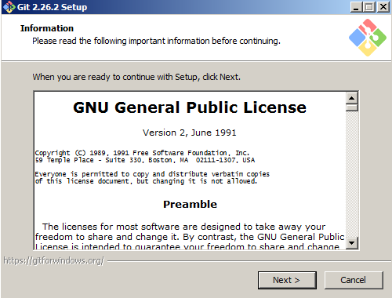

Aceptamos la licencia GNU.

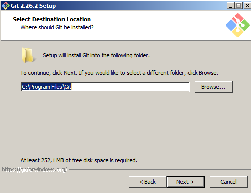

Selccionamos la ruta dónde se instalará git.

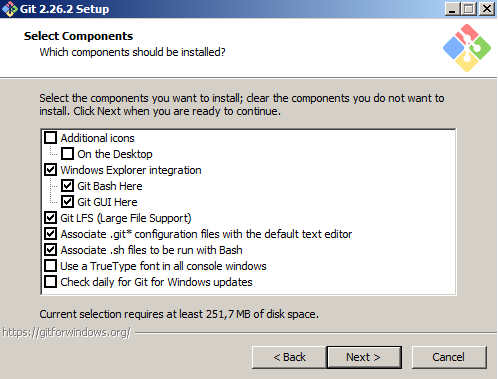

Selccionamos los componentes a instalar, dejar los valores por defecto.

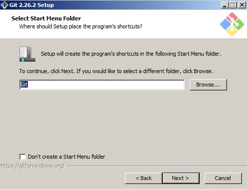

Selccionamos el atajo de Git en el menu de inicio de Windows, dejar los valores por defecto.

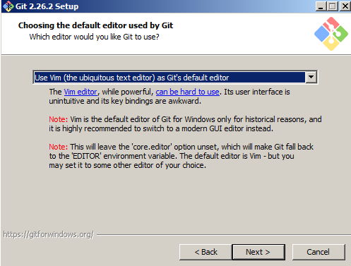

Selccionamos el editor de texto que usará Git, dejar los valores por defecto.

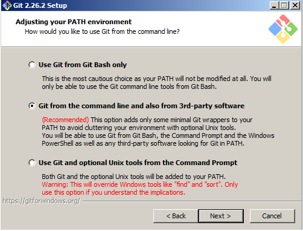

Configuramos el PATH de Git en el sistema operativo, dejar los valores por defecto.

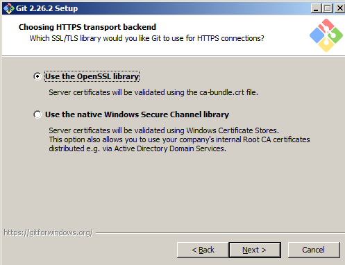

Selccionamos los componentes a instalar, dejar los valores por defecto.

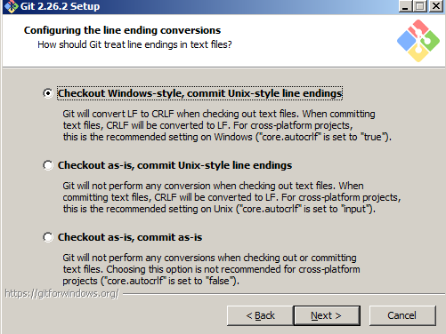

Selccionamos los protocolos de autenticación, dejar los valores por defecto.

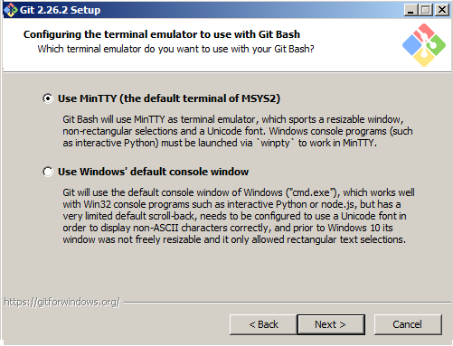

Selccionamos la opción de conversión de finales, dejar los valores por defecto.

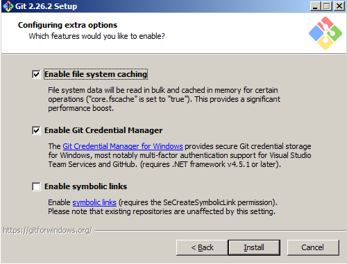

Selccionamos la opción de sistema de caché y el gestor de credenciales, dejar los valores por defecto. Luego presionamos el botón de instalar.

<b>Ahora tenemos que configurar usuario y correo de git</b>, para lo cuál vamos a ir la línea de comandos y ejecutamos los siguientes comandos:

        > git config --global user.name "Nombre Apellido"
        > git config --global user.email "<tucorreo@correo.pe>"

### <b> 2. Descargar e instalar Node JS</b> 

Usar el siguiente enlace de descarga según la arquitectura de tu ordenador, [32 bits](https://nodejs.org/dist/v12.18.3/node-v12.18.3-x86.msi) o [64 bits](https://nodejs.org/dist/v12.18.3/node-v12.18.3-x64.msi).

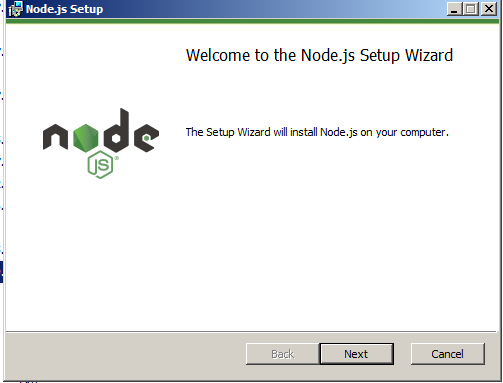

Apretamos Siguiente.

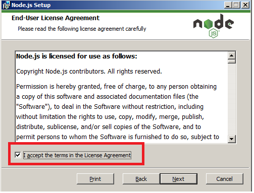

Aceptamos la licencia.

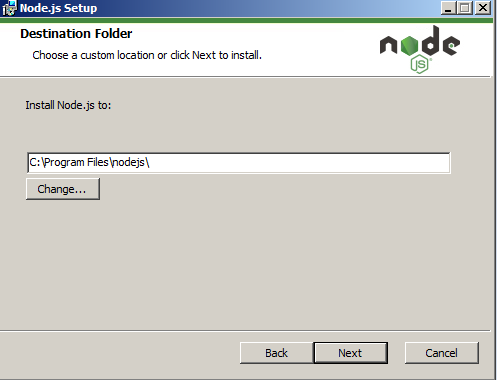

Seleccionamos el lugar de instalación.

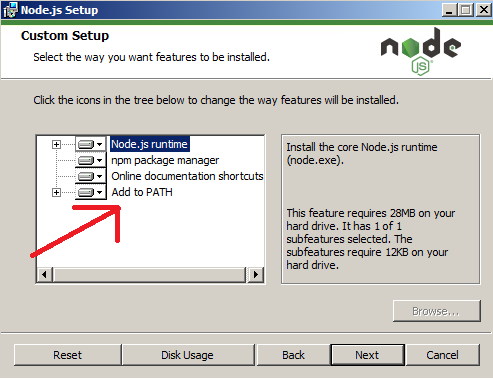

Verificamos que la instalación incluya añadir NodeJS al PATH del sistema.

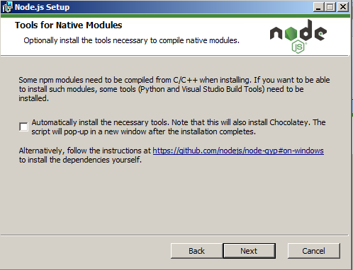

Apretamos Siguiente.

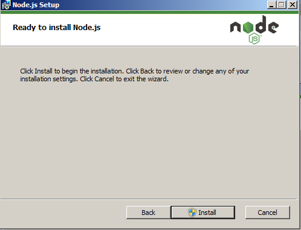

Apretamos Instalar.

###  <b>3. Descargar e instalar Visual Studio Code</b> 

Usar el siguiente enlace de descarga según la arquitectura de tu ordenador, [32 bits](https://code.visualstudio.com/docs/?dv=win32user) o [64 bits](https://code.visualstudio.com/docs/?dv=win64user).

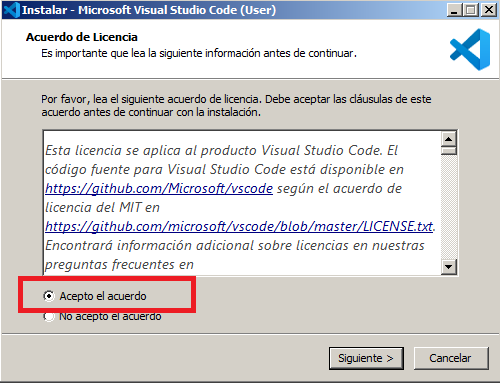

Aceptamos la licencia.

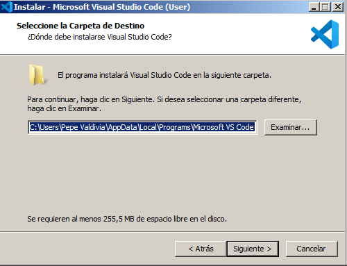

Seleccionamos la ruta en disco de la instalación.

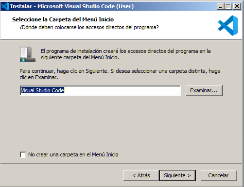

Seleccioamos la carpeta en el menú de incio.

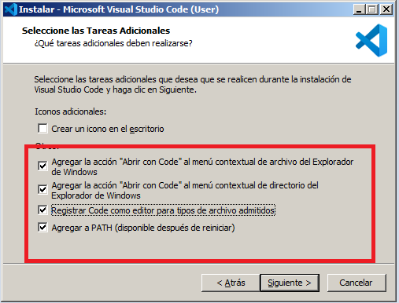

Aceptamos las opciones marcadas.

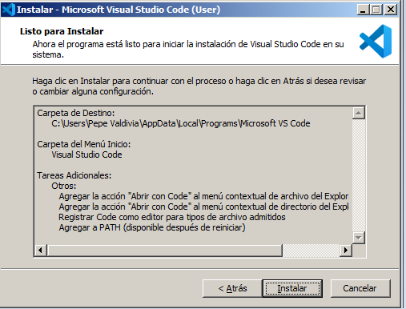

Presionamos instalar.

## <b>Usar Github</b>

### <b>1. Crear una cuenta en Github</b>.

Accedemos al siguiente enlace [link](https://github.com/join?ref_cta=Sign+up&ref_loc=header+logged+out&ref_page=%2F&source=header-home). Llenamos el formulario con nuestros datos personales.

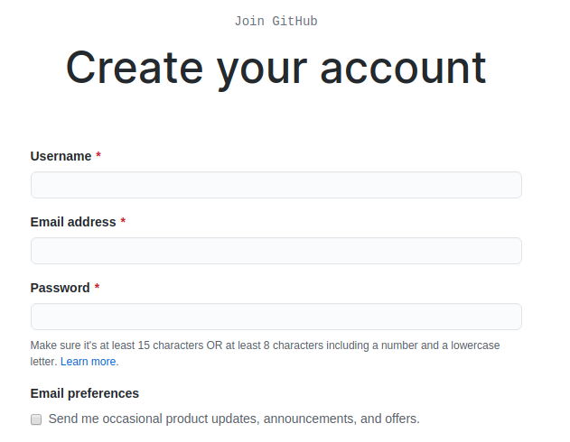

Luego hay que verificar la creación de la cuenta mediante el correo que envía Github.

### <b>2. Crear un nuevo repositorio</b>.

Una vez que se tenga la cuenta activa, vamos a crear un nuevo repositorio:

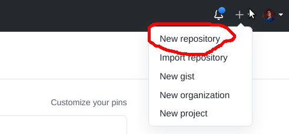

Asignamos un nombre y descripción del proyecto. Además no hay que seleccionar la opción de crear archivo README.md.

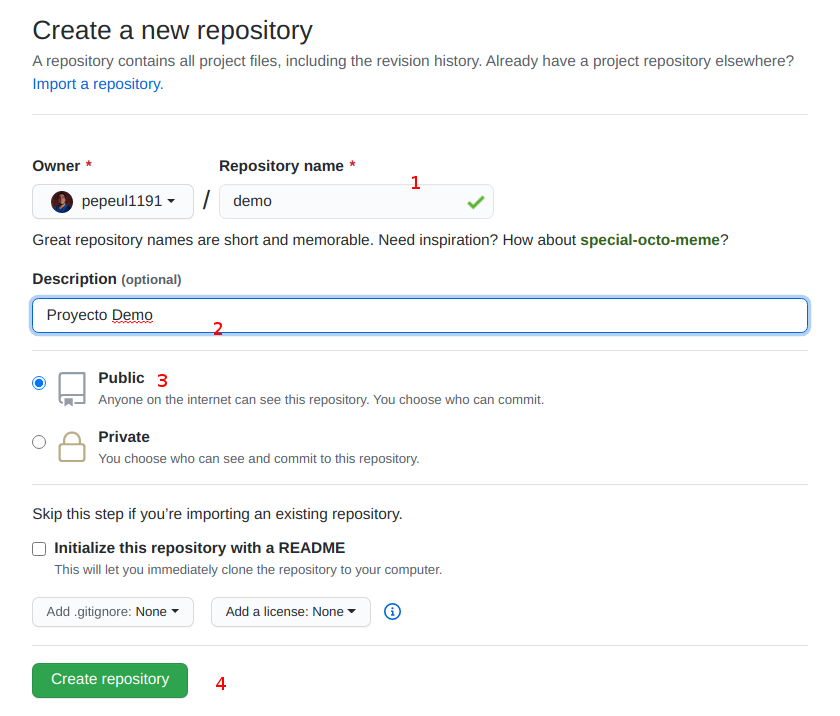

Posteriormente vamos a usar los comands de pushear un repositorio existente.

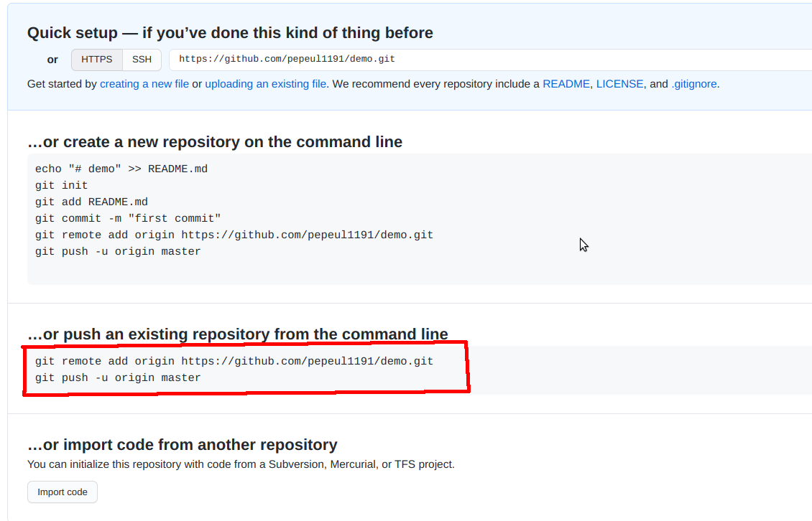

<b>El primer comando, el git remote, la dirección debe variar en función al usuario y nombre del repositorio que han creado</b>.

### <b>3. Descargar proeycto de prueba</b>.

Usamos el [enlace](https://github.com/pepeul1191/manuales/raw/master/git/src/git_tuto.zip) para descargar un proyecto ya avanzado con el fin de ejecutar comandos de git sobre dicho proyecto. Una vez descargado y descomprimido el archivo zip, vamos ejecutar los comandos de <b>git remote add</b> y <b> git push</b> de la imagen anterior.

Antes que todo, vamos a crear el archivo '.gitignore' en la para definir que carpetas y archivos no van a ser conciderados para controlar sus versiones:

```
/node_modules
package-lock.json
.DS_Store

*.log
*.gz
*.tmp
```

Primero vamos a agregar todos los archivos descargados al commit.
    > git add .

Ejecutamos el primer commit.
    
    > git commit -m "commit inicial"

Agregamos la ruta del proyecto remote git.

    > git remote add origin https://github.com/nombre-usuario/nombre-repositorio.git

Enviamos el repositorio local al remote (git push -u [nombre-remoto] [nombre-rama])

    > git push -u origin master

Si todo ha sido enviado correctamente, visualizaríamos el archivo README.md renderizado.

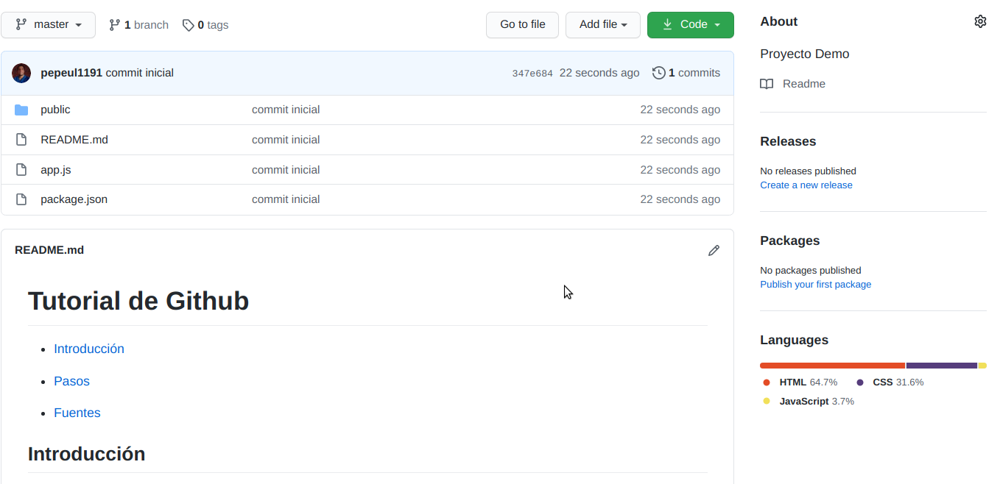

### <b>4. Agregar Accesos de Usuarios al Repositorio</b>.

Vamos a nuestro repositorio, primero a la sección <b>Settings</b> y luego a <b>Manage access</b>. Ahora presionamos el botón <b>Invite a collaborator</b> y buscamos a nuestros nuevos colaboradores para poder editar el repositorio.

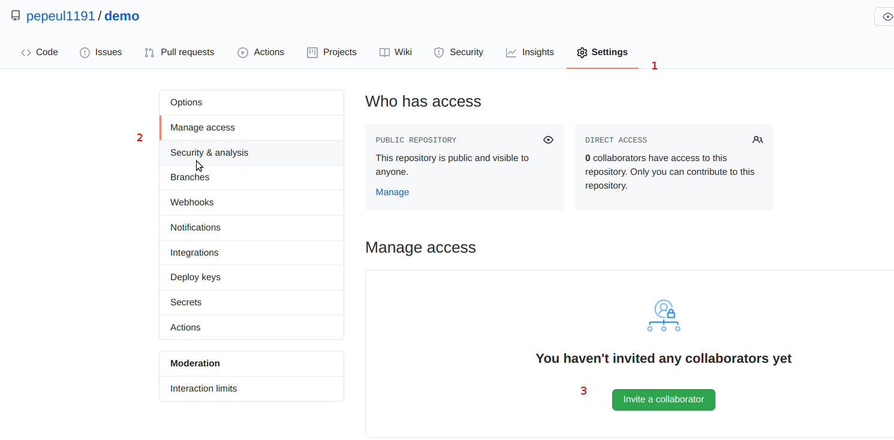


---

    $ npm runs start

La aplicación web estaría disponible en el puerto 9090.

---

## Fuentes:

+ https://github.com/StartBootstrap/startbootstrap-scrolling-nav
+ https://git-scm.com/book/es/v2/Fundamentos-de-Git-Trabajar-con-Remotos
