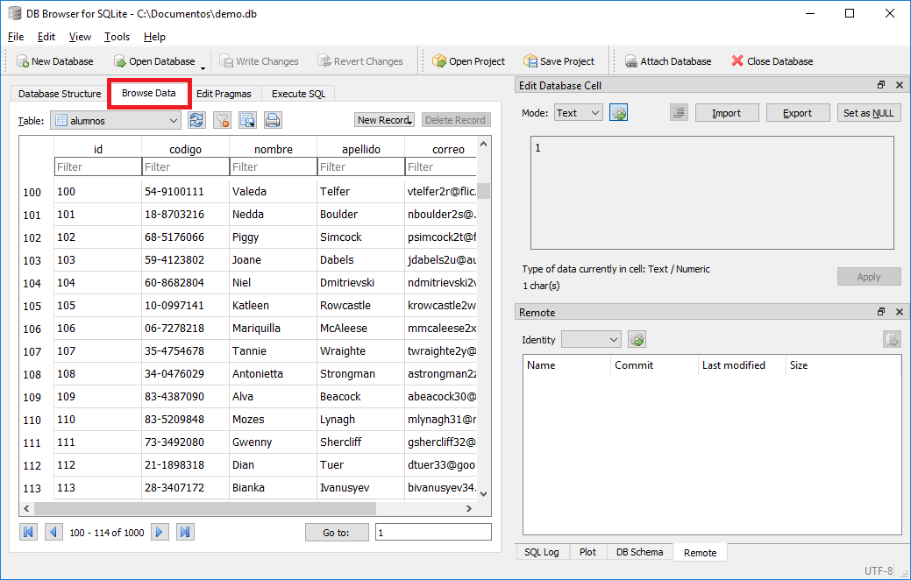

# Acceso a base de datos SQL desde Java

- [Introducción](#introduccion)

- [Introducción](#introduccion)

- [Markdown Navigation](#markdown-navigation)
    - [Features](#features)
    - [Installation](#installation)
    - [Usage](#usage)
    - [What's New?](#whats-new)
    - [Question](#question)
    - [License](#license)
    - [Fuentes](#fuentes)
    
## Introducción

Lo que se va a hacer, tecnologias a usar, maven, 

---

## Base de Datos

### Crear base de datos

A diferencia de motores de bases de datos como MySQL o MongoDB, la base de SQLite se resume a un archivo que tiene las tablas con datos. Para crear una base de datos SQLite hay que descargar un cliente gráfico llamado SQLite Browser del link [3]. Una vez descargado el cliente gráfico, hay que descomprimirlo e ingresar a la carpeta y ejecutar el archivo <b>.exe</b>

    > cd bin
    > mysqld --console --port=3306

Si todo esta bien, debería salir la siguiente ventana:

 

  

### Conectarse a la base de datos con el cliente MySQL Workbench

Buscamos el cliente MySQL Workbench en el menú de aplicaciones:

     
    
      

Una vez cargado la aplicación, creamos una nueva conexión con la nueva instacia de base de datos que hemos creado.

 

  

A continuación tenemos que ingresar los parámetros de conexion de la instacia que hemos creado. Es importante notar que nuestra base de datos no tiene contraseña y su usuario por default es 'root'; adcionalmente, el puerto a ingresar debe ser el mismo de la instacia (--port=3306). El nombre de la nueva conexión el aleatorio.

 

  

En caso que esté apagado el servidor de base de datos, al darle "Test Connection" generá un error. Una vez creada la instacia, ingresamos a la nueva conexión creada.

 

  

---

## Accediendo a la base de datos mediante Java JDBC

Auto genreate markdown navigation panel to the activity bar.

---

### Fuentes

[1] https://github.com/mkdocs/mkdocs/blob/master/docs/index.md  
[2] https://github.com/AlanWalk/markdown-navigation  
[3] https://download.sqlitebrowser.org/DB.Browser.for.SQLite-3.11.2-win64.zip