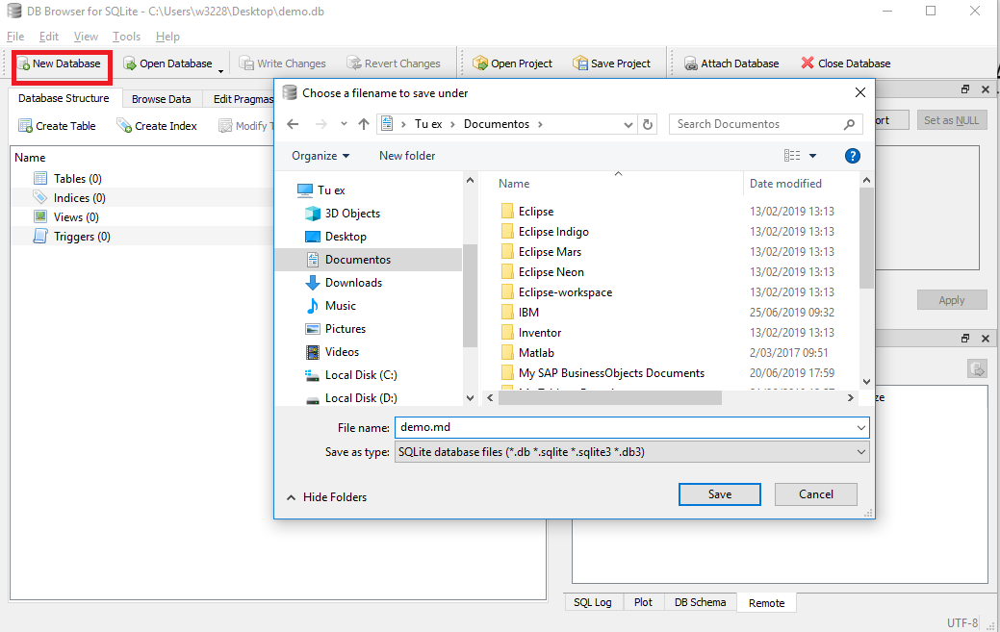
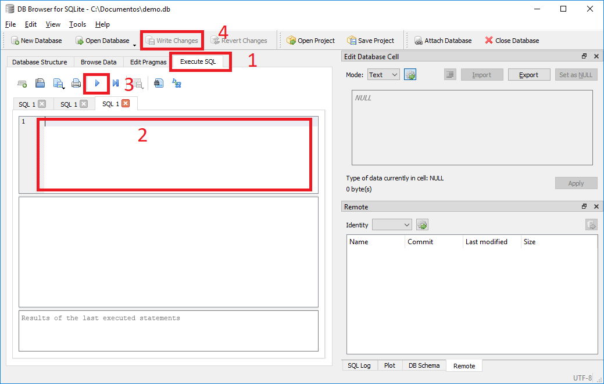
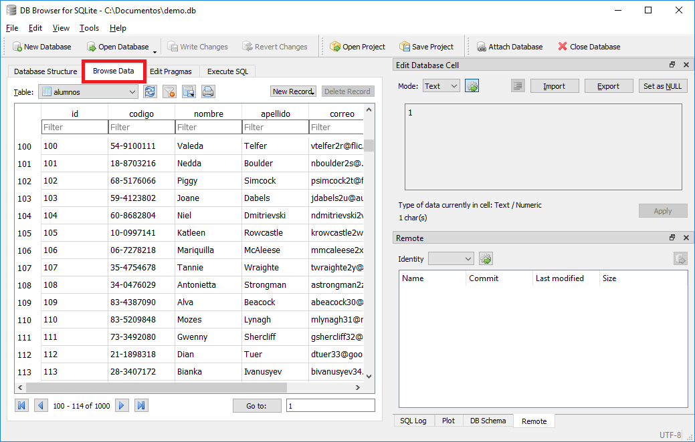
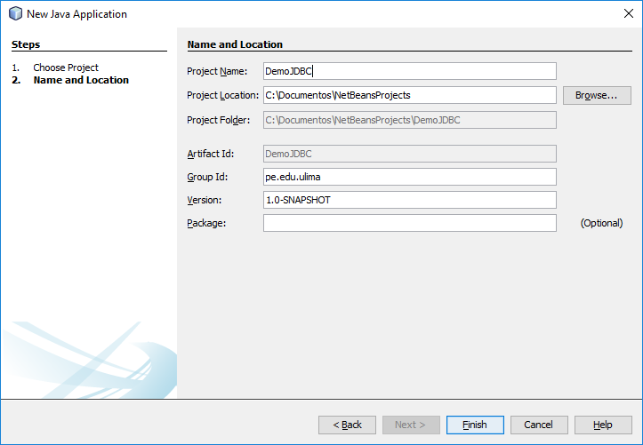
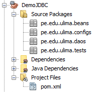

# Acceso a base de datos SQL desde Java

- [Introducción](#introducción)

- [Base de Datos](#base-de-datos)
    - [Crear base de datos](#crear-base-de-datos)
    - [Crear tablas y datos](#crear-tablas-y-datos)
    
- [Accediendo a la base de datos mediante Java JDBC](#accediendo-a-la-base-de-datos-mediante-java-jdbc)
    - [Crear proyecto maven](#crear-proyecto-maven)
    - [Agregar dependencias](#agregar-dependencias)
    - [Crear connection](#crear-connection)
    - [Crear bean](#crear-bean)
    - [Crear DAO](#crear-dao)
    - [Listar alumnos](#listar-alumnos)
    - [Ver alumno](#ver-alumno)
    - [Crear alumno](#crear-alumno)
    - [Editar alumno](#editar-alumno)
    - [Eliminar alumno](#eliminar-alumno)
    
- [Fuentes](#fuentes)
    
## Introducción

Lo que se va a hacer, tecnologias a usar, maven, 

---

## Base de Datos

### Crear base de datos

A diferencia de motores de bases de datos como MySQL o MongoDB, la base de SQLite se resume a un archivo que tiene las tablas con datos. Para crear una base de datos SQLite hay que descargar un cliente gráfico llamado SQLite Browser del [link](https://download.sqlitebrowser.org/DB.Browser.for.SQLite-3.11.2-win64.zip) [3]. Una vez descargado el cliente gráfico, hay que descomprimirlo e ingresar a la carpeta y ejecutar el archivo <b>DB Browser for SQLite.exe</b>, y aparecerá la siguiente ventana:


Ahora le damos click a <b>New Database</b>, buscamos un lugar en el disco y le podemos el nombre <b>demo.db</b> y grabamos.



Nos aparacerá una ventana para crear una tabla, le damos cerrar.

### Crear tablas y datos

Para crear la tabla que vamos a usar en el ejercicio, hay que hacer lo siguiente (ver imagen):

1) ir a la pestaña <b>Execute SQL</b>, <br>
2) copiar el código que se encuentra en el archico </b>[demo.sql](demo.sql)</b>, <br>
3) ejecutar el script, <br>
4) guardar cambios.



Los datos se podrán ver su respectiva tabla en la pestaña <b>Browse Data</b>.



---

## Accediendo a la base de datos mediante Java JDBC

### Crear proyecto maven

En Netbeans accedemos a <b>File/New Project</b> y seleccionamos Maven / <b>Java Application</b>


Asignamos un nombre de proyecto y Group.Id (pe.edu.ulima)



Una vez creado el proyecto creamos los paquetes <b>pe.edu.ulima.beans</b>, <b>pe.edu.ulima.configs</b>, <b>pe.edu.ulima.daos</b> y <b>pe.edu.ulima.test</b>. En los pasos siguientes iremos creando clases java en los distintos paquetes creados.

<p align="center">
    
</p>

### Agregar dependencias

En la carpta <b>Project Files</b> hay un archivo llamado <b>pom.xml</b>. Editamos el archivo con el siguiente código.

```xml
<dependencies>
    <dependency>
        <groupId>org.xerial</groupId>
        <artifactId>sqlite-jdbc</artifactId>
        <version>3.28.0</version>
    </dependency>
</dependencies>
```

### Crear connection

Para crear la conexión a la bases de datos desde java, hay que crear un objeto de la clase Connection el cúal será luego usado por los daos para interactuar con la base de datos. El siguiente código deberá estar en el archivo <b>Database.java</b> en el paquete <b>pe.edu.ulima.configs</b>

```java
package pe.edu.ulima.configs;

import java.sql.Connection;
import java.sql.DriverManager;
import java.sql.SQLException;

public class Database {
  private final String URL = "jdbc:sqlite:db\\demo.db";
    
  protected Connection getConnection() {
    Connection con = null;
    try {
      Class.forName("org.sqlite.JDBC");
      con = DriverManager.getConnection(URL);
    } catch (ClassNotFoundException ex) {
      ex.printStackTrace();
    } catch (SQLException ex) {
      ex.printStackTrace();
    }
    return con;
  }
}
```
Nuestra URL de conexión dice <b>"jdbc:sqlite:db\\demo.db"</b>, para que posteriormente podamos interactuar con la base de datos que hemos creado pasos anteriores tenemos que ir a la carpeta raiz del proyecto java, crear una capeta llamada <b>db</b> y colocar dentro el archivo de la base de datos SQLite <b>demo.db</b>. Si no queremos mover el archivo de la base de datos, nuestro URL de conexión deberá apuntar hasta la ubicación y nombre del archivo.

### Crear bean

Para crear una clase bean hay que tener en consideración que los atributos de esta clase deberán corresponder a las columnas de la tabla <b>alumnos</b>. Los atributos deberán ser los siguientes:

+ id (int)
+ codigo (String)
+ nombre (String)
+ apellido (String)
+ correo (String)
+ genero (String)

El siguiente código deberá estar en el archivo <b>Alumno.java</b> en el paquete <b>pe.edu.ulima.beans</b> y deberá tener su constructor vacío y su método para ver su datos en String.

```java
package pe.edu.ulima.beans;

public class Alumno {
  private int id;
  private String codigo;
  private String nombre;
  private String apellido;
  private String correo;
  private String genero;

  public Alumno() {
  }

  public Alumno(int id, String codigo, String nombre, String apellido, String correo, String genero) {
    this.id = id;
    this.codigo = codigo;
    this.nombre = nombre;
    this.apellido = apellido;
    this.correo = correo;
    this.genero = genero;
  }

  public int getId() {
    return id;
  }

  public void setId(int id) {
    this.id = id;
  }

  public String getCodigo() {
    return codigo;
  }

  public void setCodigo(String codigo) {
    this.codigo = codigo;
  }

  public String getNombre() {
    return nombre;
  }

  public void setNombre(String nombre) {
    this.nombre = nombre;
  }

  public String getApellido() {
    return apellido;
  }

  public void setApellido(String apellido) {
    this.apellido = apellido;
  }

  public String getCorreo() {
    return correo;
  }

  public void setCorreo(String correo) {
    this.correo = correo;
  }

  public String getGenero() {
    return genero;
  }

  public void setGenero(String genero) {
    this.genero = genero;
  }

  public String verInfo() {
    return "Alumno{" + "id=" + id + ", codigo=" + codigo + ", nombre=" + nombre + ", apellido=" + apellido + ", correo=" + correo + ", genero=" + genero + '}';
  } 
}
```

### Crear DAO

Ahora vamos a crear el DAO de la clase Alumno. Esta clase será la encargada de extraer los datos de la base de datos mediante la clase <b>pe.edu.ulima.configs.Database.java</b> (AlumnoDAO heredará de Database.java) e instanciando objectos de la clase Alumno con esta data.

El siguiente código deberá estar en el archivo <b>AlumnoDAO.java</b> en el paquete <b>pe.edu.ulima.daos</b>.

```java
package pe.edu.ulima.daos;

import pe.edu.ulima.configs.Database;

public class AlumnoDAO extends Database{
  public AlumnoDAO() {
  }
}
```

### Listar alumnos

En la clase DAO creada, vamos a crear un método que retorne todos los alumnos registrados en la base de datos mediante una lista de objetos alumnos.

El siguiente código deberá estar en el archivo <b>AlumnoDAO.java</b> en el paquete <b>pe.edu.ulima.daos</b>.

```java
public List<Alumno> listar(){
  List<Alumno> la = new ArrayList<Alumno>();
  Connection con = null;
  PreparedStatement pstmt = null;
  ResultSet rs = null;
  String sql = "SELECT * FROM alumnos ORDER BY id";
  try {
    con = this.getConnection();
    pstmt = con.prepareStatement(sql);
    rs = pstmt.executeQuery();
    while (rs.next() ) {
      Alumno a = new Alumno();
      a.setId(rs.getInt(1));
      a.setCodigo(rs.getString(2));
      a.setNombre(rs.getString(3));
      a.setApellido(rs.getString(4));
      a.setCorreo(rs.getString(5));
      a.setGenero(rs.getString(6));
      la.add(a);
    }
  } catch (SQLException ex) {
  ex.printStackTrace();
  } finally {
    try {
      rs.close();
      pstmt.close();
      con.close();
    } catch (SQLException ex) {
      ex.printStackTrace();
    }
  }
  return la;
}
```

Este método dependerá de las siguientes importaciones:

```java
import java.sql.Connection;
import java.sql.PreparedStatement;
import java.sql.ResultSet;
import java.sql.SQLException;
import java.util.ArrayList;
import java.util.List;
import pe.edu.ulima.beans.Alumno;
import pe.edu.ulima.configs.Database;
```

### Ver alumno

En la clase DAO creada, vamos a crear un método que retorne un sólo objeto de la clase alumno registrado en la base de datos donde exista una coincidencia por su <b>id</b>. Este <b>id</b> será el argumento de este método.

El siguiente código deberá estar en el archivo <b>AlumnoDAO.java</b> en el paquete <b>pe.edu.ulima.daos</b>.

```java
public Alumno obtener(int id){
  Alumno a = null;
  Connection con = null;
  PreparedStatement pstmt = null;
  ResultSet rs = null;
  String sql = "SELECT * FROM alumnos WHERE id = ?";
  try {
    con = this.getConnection();
    pstmt = con.prepareStatement(sql);
    pstmt.setInt(1, id);
    rs = pstmt.executeQuery();
    while (rs.next() ) {
        a = new Alumno();
        a.setId(rs.getInt(1));
        a.setCodigo(rs.getString(2));
        a.setNombre(rs.getString(3));
        a.setApellido(rs.getString(4));
        a.setCorreo(rs.getString(5));
        a.setGenero(rs.getString(6));
    }
  } catch (SQLException ex) {
  ex.printStackTrace();
  } finally {
    try {
      rs.close();
      pstmt.close();
      con.close();
    } catch (SQLException ex) {
      ex.printStackTrace();
    }
  }
  return a;
}
```

### Crear alumno

En la clase DAO creada, vamos a crear un método que nos permita registrar un alumno nuevo en la base de datos. Este método recibirá como argumento un objeto de la clase alumno ya instanciado y retornará el <b>id</b> generado en la base de datos.

El siguiente código deberá estar en el archivo <b>AlumnoDAO.java</b> en el paquete <b>pe.edu.ulima.daos</b>.

```java
  public int crear(Alumno a){
    int id = 0;
    Connection con = null;
    PreparedStatement pstmt = null;
    ResultSet rs = null;
    String sql = "INSERT INTO alumnos (codigo, nombre, apellido, correo, genero) VALUES (?,?,?,?,?)";
    try {
      con = this.getConnection();
      pstmt = con.prepareStatement(sql);
      pstmt.setString(1, a.getCodigo());
      pstmt.setString(2, a.getNombre());
      pstmt.setString(3, a.getApellido());
      pstmt.setString(4, a.getCorreo());
      pstmt.setString(5, a.getGenero());
      pstmt.executeUpdate();
      rs = pstmt.getGeneratedKeys();
      id = rs.getInt(1);
    } catch (SQLException ex) {
      ex.printStackTrace();
    } finally {
      try {
        rs.close();
        pstmt.close();
        con.close();
      } catch (SQLException ex) {
        ex.printStackTrace();
      }
    }
    return id;
  }
```

### Editar alumno

En la clase DAO creada, vamos a crear un método que nos permita editar un alumno en la base de datos. Este método recibirá como argumento un objeto de la clase alumno ya instanciado el mismo que será editado en la base de datos según el <b>id</b> de dicho objeto. El método no tendrá ningún retorno.

El siguiente código deberá estar en el archivo <b>AlumnoDAO.java</b> en el paquete <b>pe.edu.ulima.daos</b>.

```java
public void editar(Alumno a){
  Connection con = null;
  PreparedStatement pstmt = null;
  String sql = "UPDATE alumnos SET codigo = ?, nombre = ?, apellido = ?, correo = ?, genero = ? WHERE id = ?";
  try {
    con = this.getConnection();
    pstmt = con.prepareStatement(sql);
    pstmt.setString(1, a.getCodigo());
    pstmt.setString(2, a.getNombre());
    pstmt.setString(3, a.getApellido());
    pstmt.setString(4, a.getCorreo());
    pstmt.setString(5, a.getGenero());
    pstmt.setInt(6, a.getId());
    pstmt.executeUpdate();
  } catch (SQLException ex) {
    ex.printStackTrace();
  } finally {
    try {
      pstmt.close();
      con.close();
    } catch (SQLException ex) {
      ex.printStackTrace();
    }
  }
}
```

### Eliminar alumno

En la clase DAO creada, vamos a crear un método que nos permita eliminar un alumno en la base de datos. Este método recibirá como argumento un el <b>id</b> del alumno a eliminar. El método no tendrá ningún retorno.

El siguiente código deberá estar en el archivo <b>AlumnoDAO.java</b> en el paquete <b>pe.edu.ulima.daos</b>.

```java
public void eliminar(int id){
  Connection con = null;
  PreparedStatement pstmt = null;
  String sql = "DELETE FROM alumnos WHERE id = ?";
  try {
    con = this.getConnection();
    pstmt = con.prepareStatement(sql);
    pstmt.setInt(1, id);
    pstmt.executeUpdate();
  } catch (SQLException ex) {
    ex.printStackTrace();
  } finally {
    try {
      pstmt.close();
      con.close();
    } catch (SQLException ex) {
      ex.printStackTrace();
    }
  }
}
```

---

### Fuentes

[1] https://github.com/mkdocs/mkdocs/blob/master/docs/index.md <br>
[2] https://github.com/AlanWalk/markdown-navigation <br>
[3] https://download.sqlitebrowser.org/DB.Browser.for.SQLite-3.11.2-win64.zip <br>
[4] https://mvnrepository.com/artifact/org.xerial/sqlite-jdbc <br>
[5] https://www.tutorialspoint.com/sqlite/sqlite_java.htm <br>
[6] https://stackoverflow.com/questions/1915166/how-to-get-the-insert-id-in-jdbc <br>