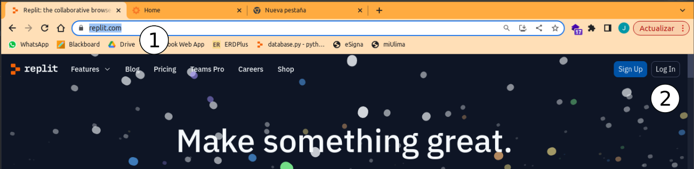
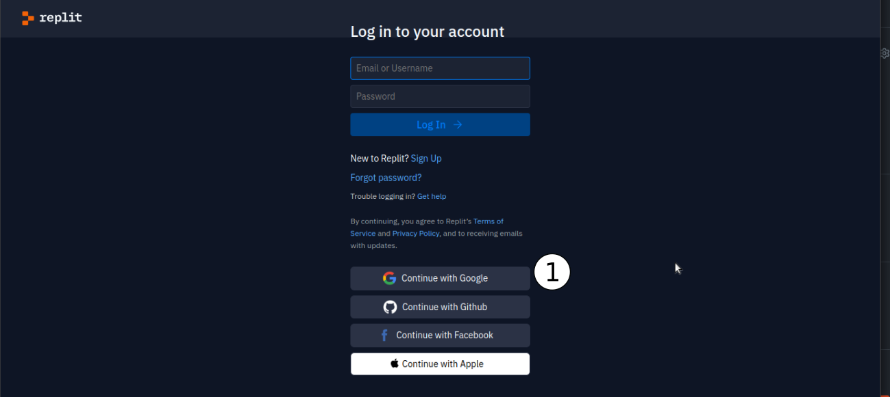
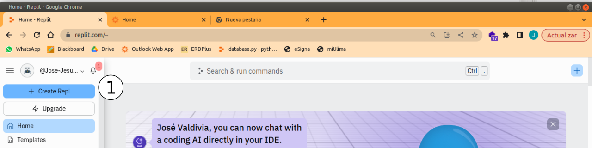
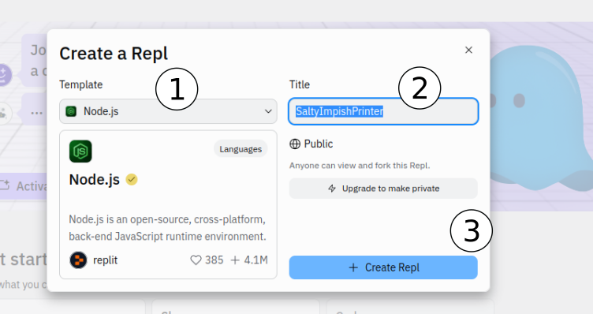
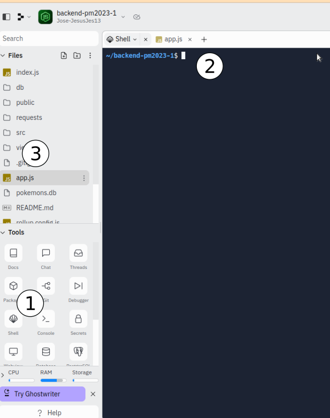
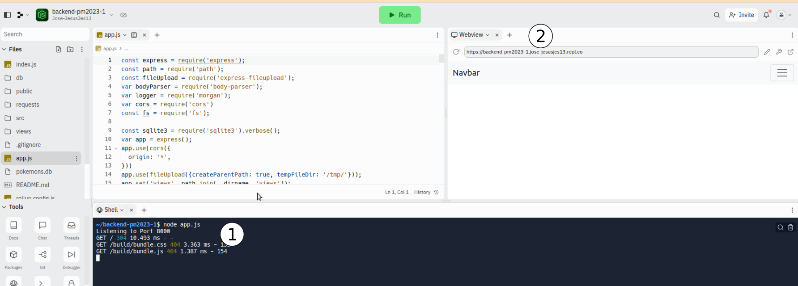

# Despliegue de ExpressJS en Replit

- [Introducción](#introducción)
- [Crear cuenta en Replit](#crear-cuenta-en-replit)
- [Descargar proyecto existente y ejecutarlo](#descargar-proyecto-existente-y-ejecutarlo)

---

## Introducción

Se desplegará una aplicación en Express JS en Replit

## Crear cuenta en Replit

Para crar una cuenta en Replit usaremos una cuenta existente de Gmail, los pasos son los siguientes

1) Entrar a https://replit.com/
2) Ir a Login

1) Entrar con nuestra cuenta de Google

## Descargar proyecto existente y ejecutarlo

Ahora que estamos logueados en Replit, vamos a crear un proyecto en NodeJS. Para descargar el proyecto usaremos Git. Antes de poder ejecutar el proyecto, tenemos que instalar las depedencias del proyecto. Una vez que el proyecto esté funcionando, será accesible por medio de un navegador web.

1) Creamos un nuevo proyecto

1) Seleccionamos un proyecto en NodeJS
2) Le asignamos un nombre, por el contrario, Replit le asignará uno al azar.
3) Creamo el proyecto

1) Hacemos click en Shell
2) En la linea de comando escribimos lo siguiente:

    $ git clone https://github.com/pepeul1191/ExpressJS---Svelte tmp

Este código descargará un proyecto Git desde Github.

3) Movemos el contenido de la carpeta tmp a la raiz del directorio de archivos.

1) Nuevamente en el Shell vamos a hacer lo siguiente:

Vamos a descargar las dependencias:

    $ npm install

Una vez descarga las dependencias, ejecutamos el proyecto:

    $ node app.js

2) Si todo se ejecuta sin errores, dentro de la venta de replit aparecerá un navegador web, el cuál tiene una url. Esta url es la url del proyecto, la cuál la podemos usar desde cualquier navegador web.

---

Fuentes:

- https://stackoverflow.com/questions/5377960/git-whats-the-best-practice-to-git-clone-into-an-existing-folder
- https://github.com/pepeul1191/ExpressJS---Svelte
https://github.com/pepeul1191/manuales