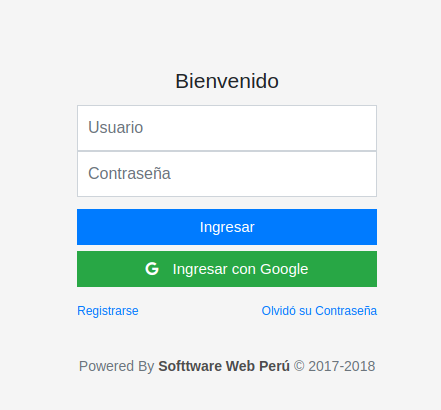
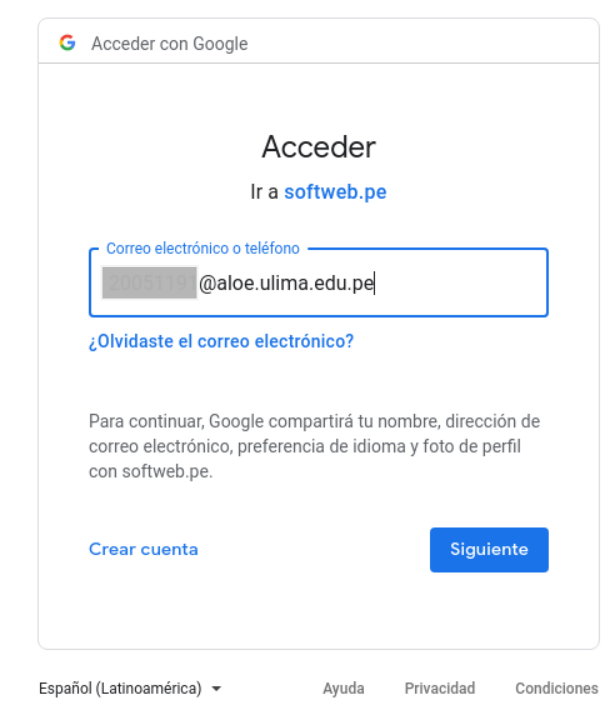
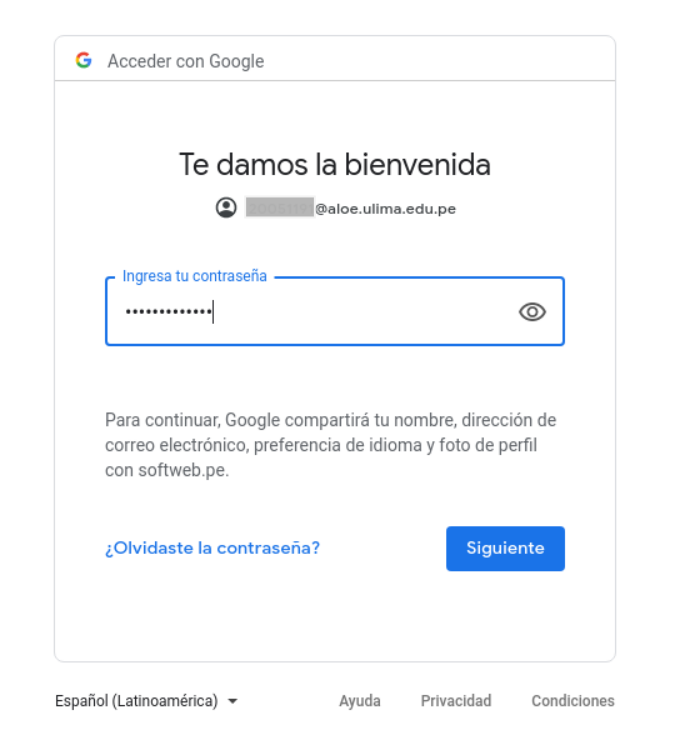
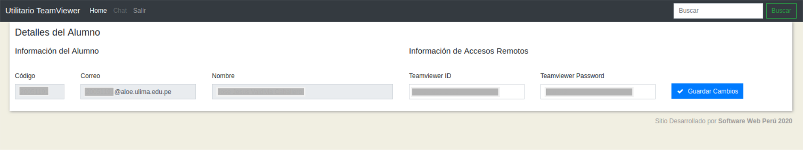

# Acceso a base de datos SQL desde Java

- [Introducción](#introducción)

- [Pasos](#pasos)
    
- [Fuentes](#fuentes)
    
## Introducción

Tutorial para acceder a la plataforma para registrar su id y pass de Teamviewer

---

## Pasos

1. Ingresar al sitio web [http://softweb.pe/tw/login]

Ahora le damos click a <b>Ingresar con Google</b>. Esto nos redireccionará a los servidores de Google.

2. Ingresar tu usuario de correo electrónico de la Univerdidad de Lima (xyz@aloe.ulima.pe).

3. Ingresar tu contraseña.

4. Una vez logueado correctamente, el servidor de Google lo redireccionará nuevamente a la aplicacón web.

En la aplicación web, deberá actualizar su Id y Password de Teamviewer llenando los campos correspondientes y dando click al botón <b>Guardar Cambios</b>